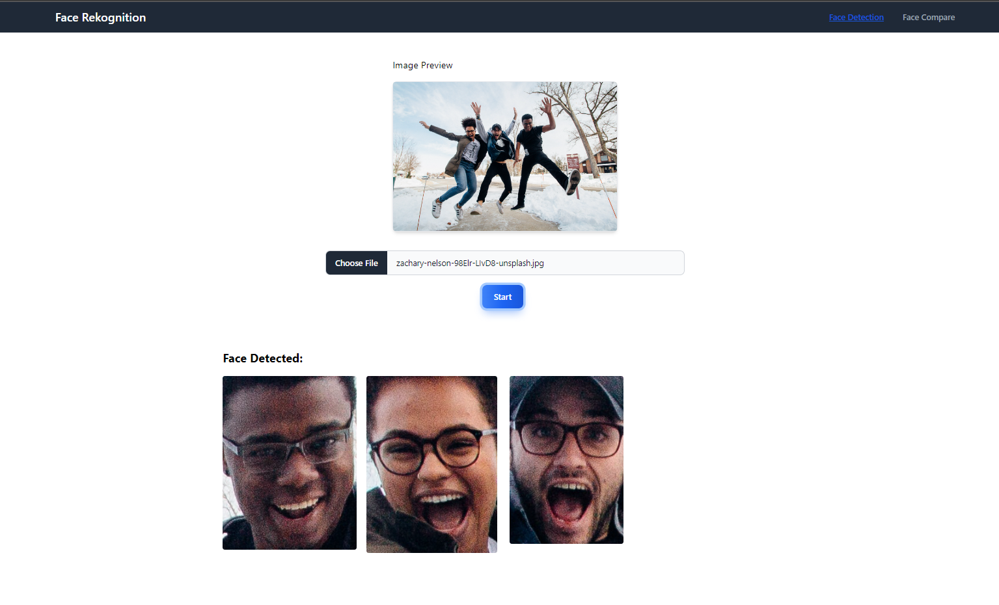

# Face Rekognition WebApp
Using AWS Rekognition **AWS SDK for JavaScript v3**, implemented in NodeJS/ExpressJS as backend and ReactJS for front end

**Face Detection**: The AWS Rekognition **DetectFaces** will return **bounding box** coordinates and we will use that value to crop the face, once crop will convert it to base64. 

**Face Compare**: Not yet implemented

## To use

### Requirements:
- NodeJS
- AWS Credentials
  - make sure you setup the aws credential
    - **Windows**: C:\Users\Profile\.aws\credentials
      - this contain, *aws_access_key_id* and *aws_secret_access_key*
  - or follow this: https://docs.aws.amazon.com/cli/latest/userguide/cli-configure-envvars.html

### To Install
1. Clone this repository
2. copy the .env.copy and rename it to .env
  - change the value of **AWS_REGION** and **PORT** if there's any
3. in *face-rekognition-app* directory 
  - run `npm install`
  - after running, `cd client` and run `npm install`

4. run the app
  - for backend: in *face-rekognition-app* directory run `npm run start`
  - for frontend: in *face-rekognition-app* `cd client` and `npm run start`

### Sample
  